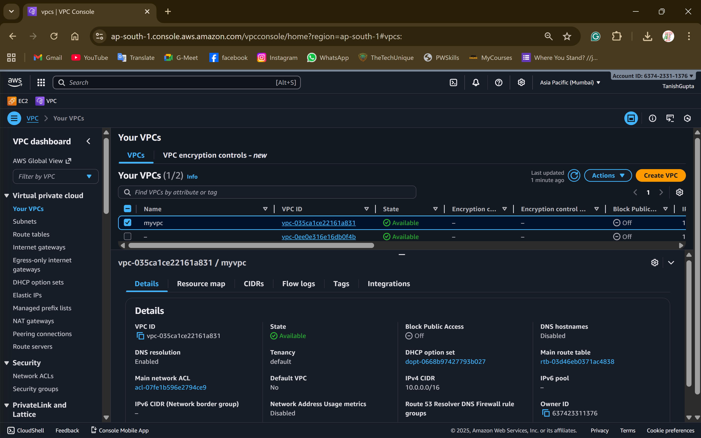
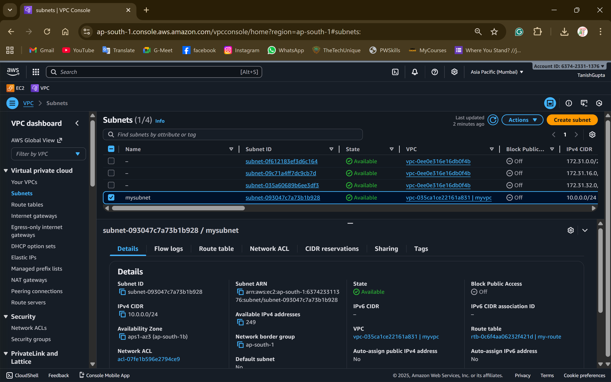
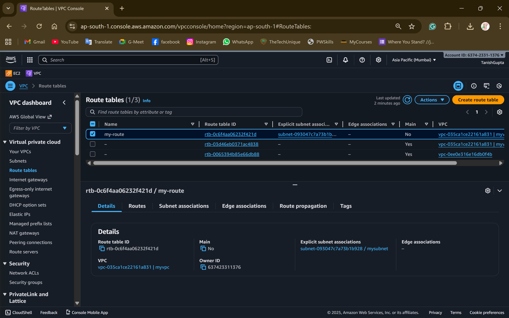
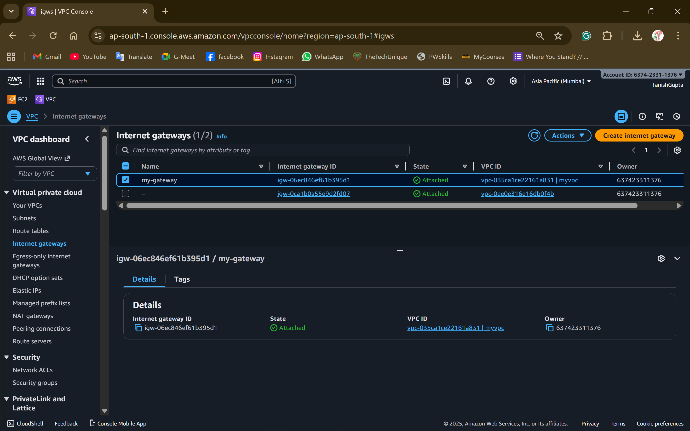

# Task 1: Networking & Subnetting (AWS VPC Setup)

## Approach

This task implements a foundational AWS network architecture using Terraform. The design follows AWS best practices for a multi-tier network:

1. **VPC Design**: Created a VPC with CIDR block `10.0.0.0/16`, providing 65,536 IP addresses for scalability.
2. **Public Subnets**: Two public subnets (`10.0.1.0/24` and `10.0.2.0/24`) across different AZs for high availability, each supporting 256 hosts for internet-facing resources.
3. **Private Subnets**: Two private subnets (`10.0.11.0/24` and `10.0.12.0/24`) isolated from direct internet access for backend services and databases.
4. **Internet Gateway**: Attached to VPC to enable public subnet internet connectivity.
5. **NAT Gateway**: Deployed in the first public subnet to allow private subnet resources to access the internet for updates while remaining protected from inbound traffic.

## AWS Screenshots

### VPC

### Subnets

### Route Tables

### NAT Gateway & Internet Gateway

