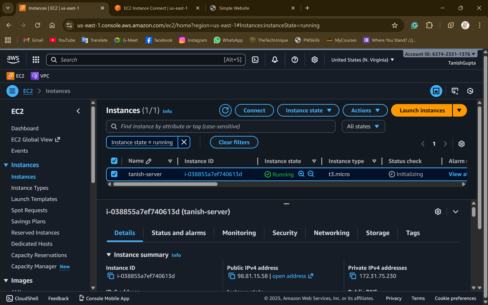
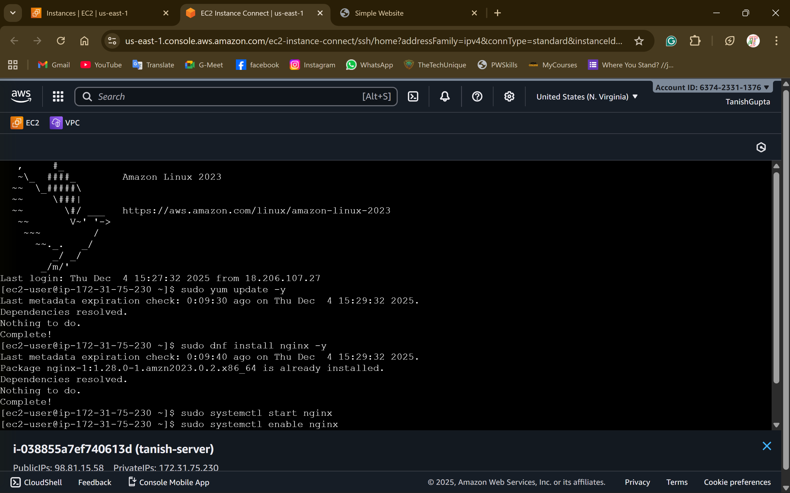
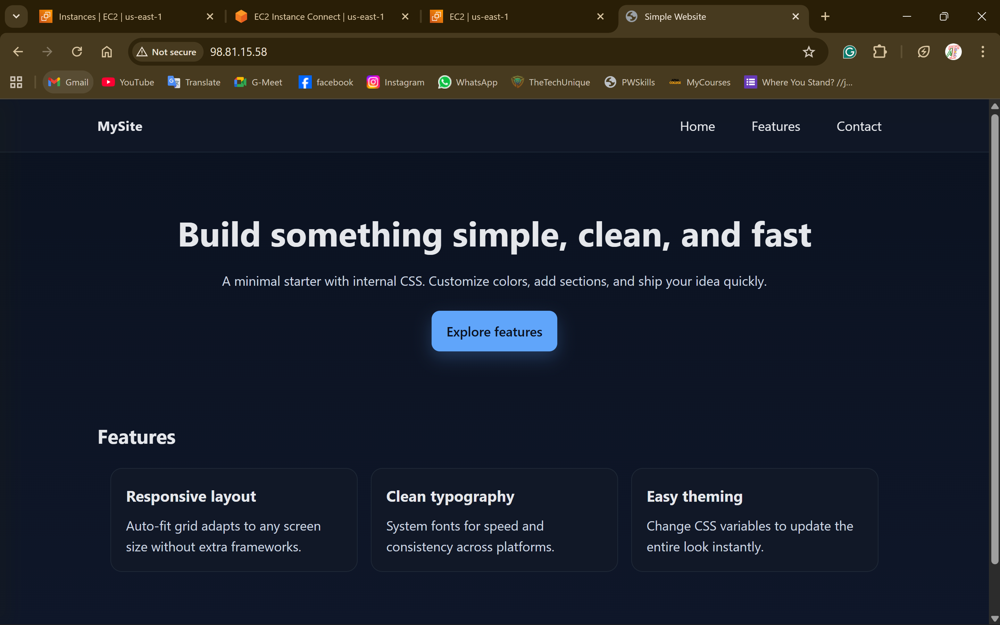

# Task 2: EC2 Static Website Hosting

## Approach

This task deploys a static resume website on an EC2 instance using Nginx with infrastructure hardening:

1. **EC2 Instance Setup**: Launched a t2.micro instance (Free Tier eligible) in a public subnet with Amazon Linux 2023 AMI for latest security patches and performance.
2. **Nginx Installation**: Used user_data script to automatically install and configure Nginx on instance launch, deploying a professional HTML resume template.
3. **Security Hardening**: Implemented multiple security best practices:
   - Restricted SSH access to specific IP (configurable via `my_ip` variable)
   - Enabled IMDSv2 (Instance Metadata Service v2) to prevent SSRF attacks
   - Encrypted EBS root volume at rest
   - Enabled detailed monitoring for better observability
   - Security group follows least privilege principle (only ports 80 and 22)
4. **Automation**: Entire setup is fully automated through Terraform with no manual configuration required.

## Security Best Practices Implemented

- **IMDSv2**: Protects against SSRF and credential theft
- **EBS Encryption**: Data at rest protection
- **Restrictive Security Groups**: Only necessary ports exposed
- **SSH IP Restriction**: Limit SSH access to known IPs
- **Detailed Monitoring**: Enhanced CloudWatch metrics

## AWS Screenshots

### EC2 Instance

### Security Groups

### Website in Browser

