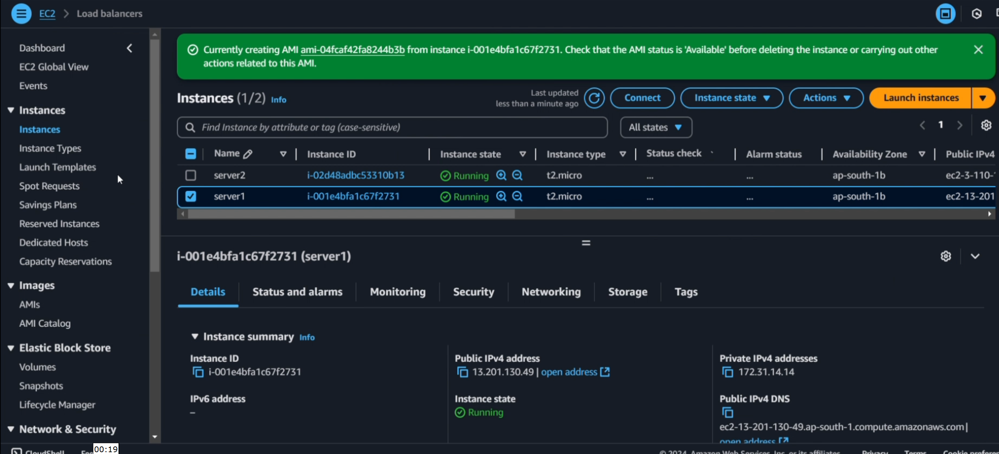
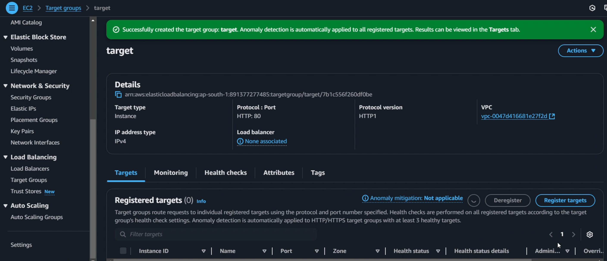
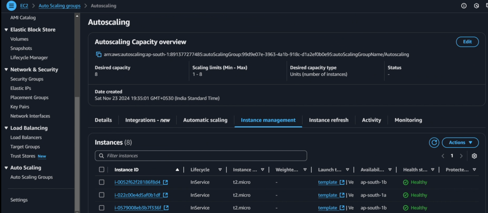
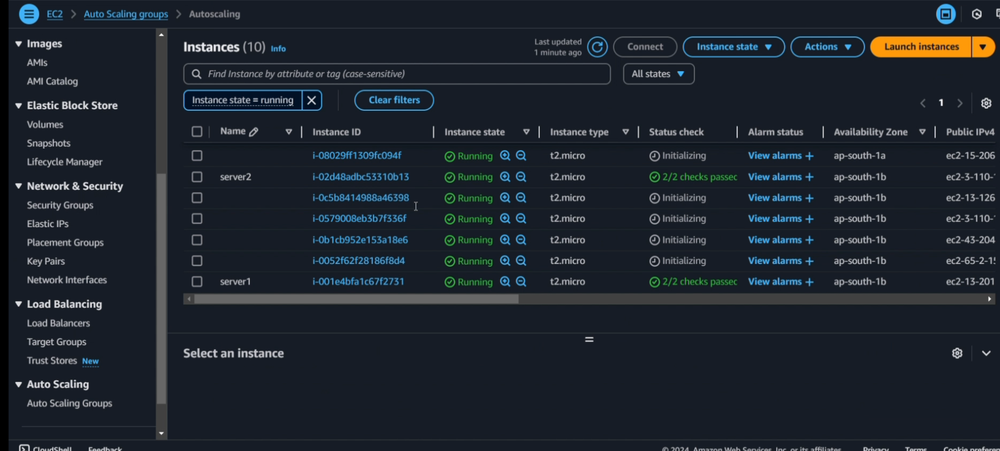
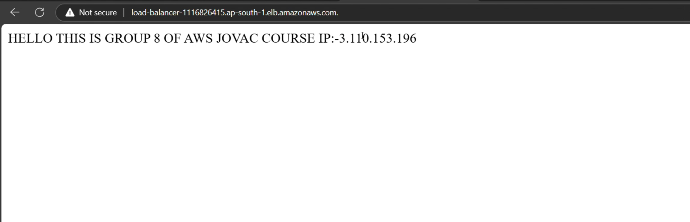

# Task 3: High Availability + Auto Scaling

## Approach

This task implements a highly available architecture by migrating the static website to a multi-AZ setup with automatic scaling:

1. **Application Load Balancer (ALB)**: Internet-facing ALB deployed across two public subnets in different AZs, providing automatic traffic distribution and health-based routing with cross-zone load balancing enabled.
2. **Private Subnet Migration**: EC2 instances moved to private subnets for enhanced security, accessible only through the ALB, with outbound internet access via NAT Gateway for updates.
3. **Auto Scaling Group (ASG)**: Configured with min 2, desired 2, max 4 instances across multiple AZs ensuring fault tolerance. Instances are automatically replaced if health checks fail.
4. **Dynamic Scaling**: CloudWatch alarms trigger scale-up when CPU > 70% and scale-down when CPU < 30%, optimizing costs while maintaining performance.
5. **Traffic Flow**: Public Internet → ALB (public subnets) → Target Group → EC2 instances (private subnets) → NAT Gateway → Internet (for updates).

## High Availability Architecture

The architecture ensures:
- **Fault Tolerance**: Instances span multiple AZs; if one AZ fails, traffic routes to healthy instances
- **Automatic Recovery**: ASG replaces unhealthy instances automatically
- **Zero Downtime**: Rolling updates and health checks prevent service interruption
- **Scalability**: Automatic scaling based on demand (CPU metrics)
- **Security**: Instances in private subnets, only ALB exposed to internet

## Traffic Flow

```
Internet Users
    ↓
Application Load Balancer (Public Subnets, Multi-AZ)
    ↓
Target Group (Health Checks)
    ↓
EC2 Instances (Private Subnets, Multi-AZ, Auto Scaling)
    ↓ (Outbound only)
NAT Gateway → Internet Gateway → Internet
```

## AWS Screenshots

### Application Load Balancer


### Target Group


### Auto Scaling Group


### EC2 Instances (launched via ASG)


### Website showing Multi-AZ deployment


