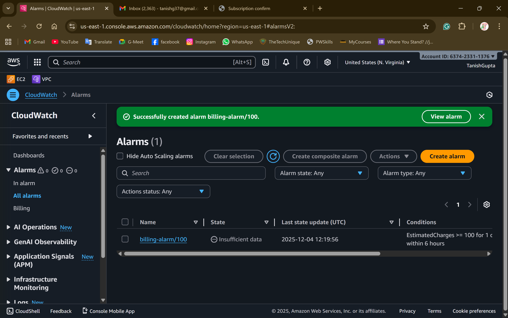
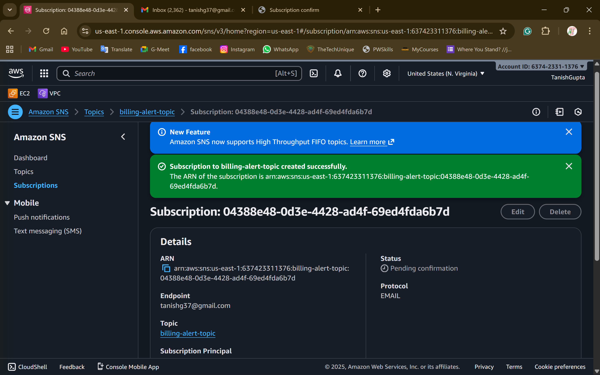
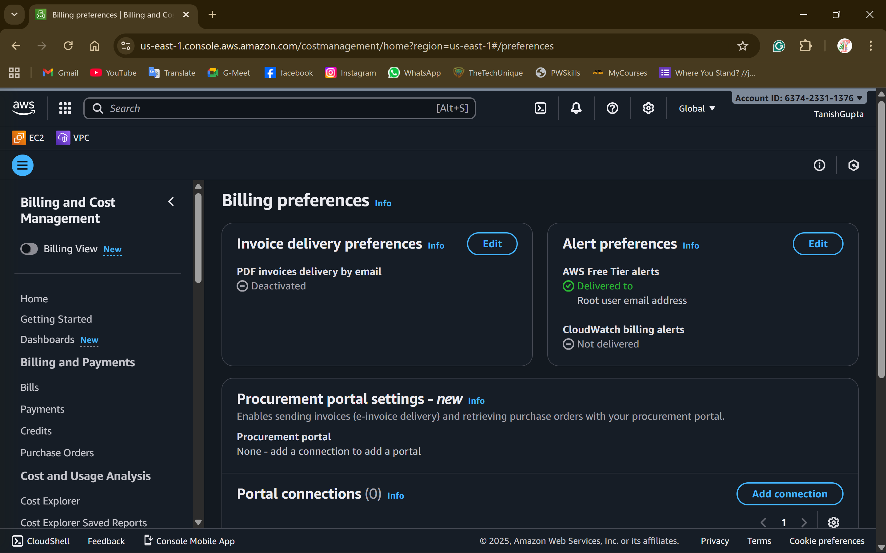
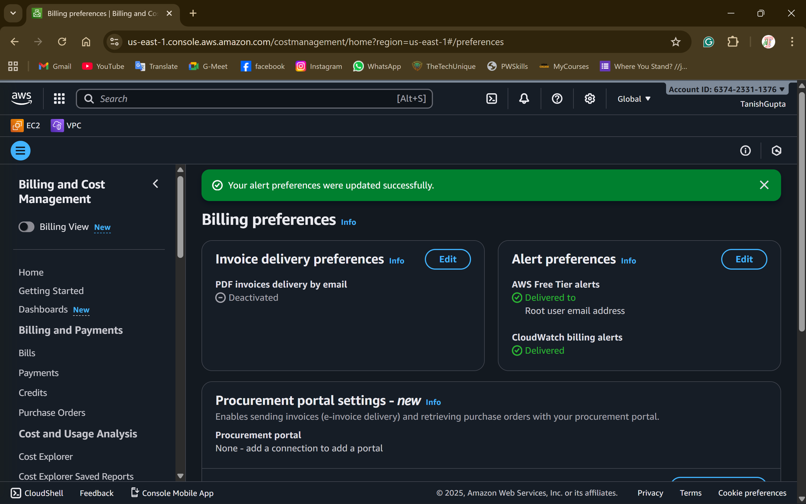

# Task 4: Billing & Cost Monitoring

## Why Cost Monitoring is Important for Beginners

Cost monitoring is critical for AWS beginners for several reasons:

1. **Prevent Bill Shock**: AWS operates on a pay-as-you-go model. Without monitoring, costs can accumulate rapidly, leading to unexpected bills of hundreds or thousands of dollars.
2. **Free Tier Protection**: AWS Free Tier has limits (750 hours/month for t2.micro, 15 GB S3 storage, etc.). Exceeding these limits triggers charges. Alerts help you stay within free tier boundaries.
3. **Learning Safe Practices**: Early exposure to cost monitoring teaches financial responsibility in cloud resource management, a crucial skill for production environments.
4. **Resource Leak Detection**: Forgotten resources (running EC2 instances, undeleted EBS volumes, idle RDS databases) continue to incur charges. Billing alarms act as safety nets.
5. **Budget Control**: Students and learners often have limited budgets. Cost alerts ensure you don't exceed your financial constraints while experimenting with AWS services.

## What Causes Sudden AWS Bill Increases

Common causes of unexpected AWS charges:

1. **Forgotten Running Instances**: EC2 instances left running 24/7 instead of stopping them after use (t2.micro costs ~$8-10/month if running continuously).
2. **Data Transfer Costs**: Large data transfers out of AWS (especially cross-region or to internet) can be expensive. Even Free Tier doesn't cover all data transfer.
3. **EBS Volumes**: Unattached EBS volumes continue to incur storage costs even after terminating EC2 instances. Snapshots also accumulate charges.
4. **NAT Gateway**: Costs $0.045/hour (~$32/month) plus data processing charges. One of the most expensive resources in Free Tier setups.
5. **Load Balancers**: ALB/NLB cost $0.0225/hour (~$16/month) plus data processing. These aren't covered by Free Tier.
6. **RDS Databases**: Multi-AZ deployments, large instance types, or storage exceeding free tier (20GB) can generate significant costs.
7. **S3 Requests**: Excessive API calls (PUT, GET, LIST) beyond free tier limits (2,000 PUT, 20,000 GET) incur charges.
8. **Elastic IPs**: Unassociated Elastic IPs cost $0.005/hour. Always release unused IPs.
9. **CloudWatch Logs**: Log retention and ingestion beyond free tier can accumulate costs over time.
10. **Auto Scaling Mishaps**: Incorrectly configured Auto Scaling can launch many instances, multiplying costs rapidly.

## Deployment Instructions

### Step 1: Enable Billing Metrics (Required First)

Before deploying Terraform, enable billing metrics in AWS Console:

1. Log in to AWS Console
2. Go to **CloudWatch** → **Settings** (or search "CloudWatch Preferences")
3. Check **"Receive Billing Alerts"**
4. Click **"Confirm preferences"**

**Note**: Billing metric updates can take up to 24 hours to start appearing.

1. **Confirm SNS subscription**: Check your email for a confirmation message from AWS SNS and click the confirmation link. Without this, you won't receive alerts.

### Step 3: Enable Free Tier Usage Alerts (Manual)

Free Tier usage alerts cannot be configured via Terraform. Enable them manually:

1. Go to **AWS Billing Dashboard**
2. Navigate to **Billing Preferences** (left sidebar)
3. Enable these options:
   - ✅ **Receive Free Tier Usage Alerts**
   - ✅ **Receive Billing Alerts**
4. Enter your email address
5. Click **"Save preferences"**

### Step 4: Take Screenshots

Capture screenshots of:
- CloudWatch Billing Alarm configuration
- SNS Topic and subscription status
- Billing Preferences showing Free Tier usage alerts enabled
- Optional: Billing Dashboard showing current charges

Add screenshots below.

## AWS Screenshots

### CloudWatch Billing Alarm

### SNS Topic & Subscription

### Free Tier Usage Alerts

### Billing Dashboard

## Testing the Alarm

To verify the alarm is working:

1. **Check Alarm State**: Go to CloudWatch → Alarms. The alarm should be in "OK" state if charges are below threshold.
2. **Simulate Alert** (optional): You cannot manually trigger a billing alarm, but you can check CloudWatch metrics:
   - Go to CloudWatch → Metrics → Billing
   - View `EstimatedCharges` metric
3. **SNS Confirmation**: Ensure your email subscription shows "Confirmed" status in SNS console.

## Best Practices for Cost Control

1. **Stop, Don't Just Pause**: Always stop or terminate instances when not in use.
2. **Use Free Tier Wisely**: Monitor usage at https://console.aws.amazon.com/billing/home#/freetier
3. **Set Multiple Alarms**: Create alarms at different thresholds (₹50, ₹100, ₹200) for early warnings.
4. **Tag Resources**: Use consistent tags to track which resources belong to which projects.
5. **AWS Budgets**: Consider using AWS Budgets for more advanced cost management.
6. **Delete Unused Resources**: Regularly audit and delete EBS volumes, snapshots, and Elastic IPs.
7. **Use Cost Explorer**: Analyze spending patterns in AWS Cost Explorer.
